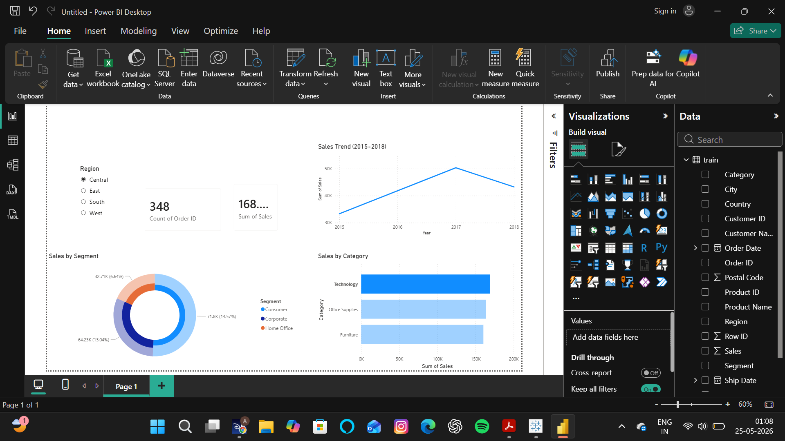

# Retail Sales Dashboard (Power BI)

## Overview
This project presents an interactive sales dashboard built using Power BI to analyze retail sales performance.

## Features
- Total Sales KPI
- Total Orders KPI
- Sales Trend Analysis
- Category-wise Sales Analysis
- Segment-wise Sales Distribution
- Region-based Filtering

## Tools Used
- Power BI
- Data Visualization
- Business Analytics

## Dashboard Preview

## Key Insights
- Technology generated the highest sales.
- Consumer segment contributed the largest share of sales.
- Sales trends can be analyzed over multiple years.
- Regional filters allow interactive exploration of the data.

## Author
Ashwath S
